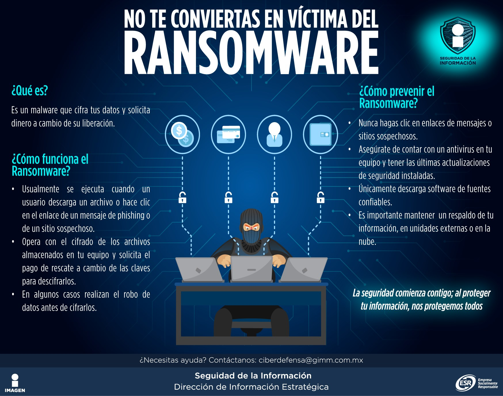
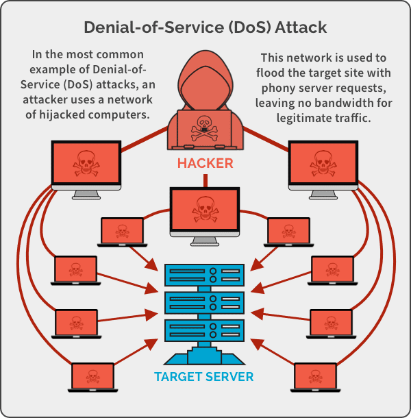
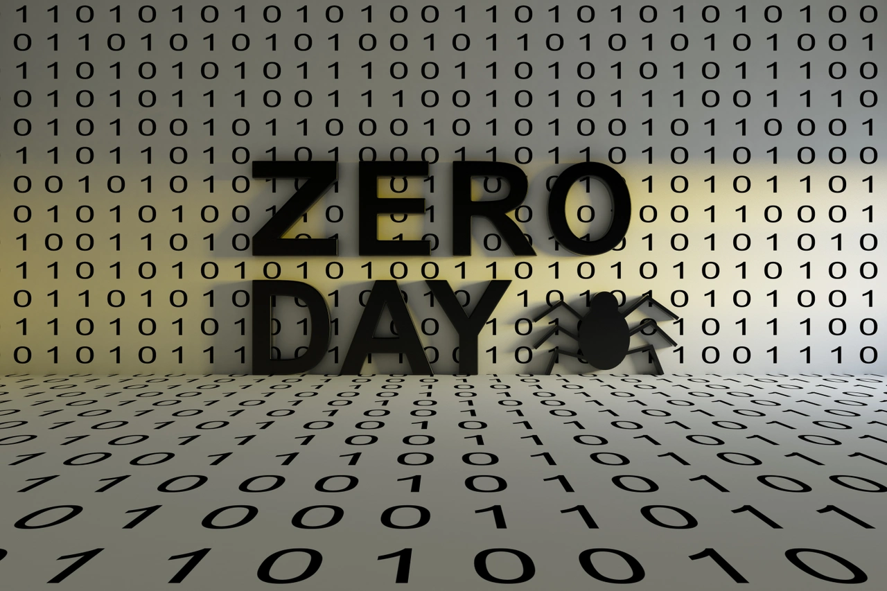

**
TOP 8 TYPES OF CYBER ATTACK
**

-------
En la era digital actual, las amenazas cibernéticas se han convertido en una preocupación crítica para individuos, empresas y gobiernos. A medida que la tecnología avanza y la conectividad se expande, también lo hacen las tácticas y técnicas utilizadas por los ciberdelincuentes. Estas amenazas no solo comprometen la seguridad de la información, sino que también pueden tener repercusiones financieras, legales y reputacionales significativas.

Las amenazas cibernéticas abarcan una amplia gama de actividades maliciosas, desde el robo de datos hasta ataques de ransomware, pasando por el phishing y el spoofing. Cada una de estas amenazas presenta desafíos únicos y requiere enfoques específicos para su mitigación. A continuación, se presenta el TOP 8 de amenazas cibernéticas más importantes que enfrentamos hoy en día:

<table>
<thead>
<tr>
<th>1. PHISHING</th>
<th>2. RANSOMWARE</th>
<th>3. DENIAL OF SERVICE (DoS)</th>
<th style="text-align: left">4. MAN N THE MIDDLE (MITM)</th>
</tr>
</thead>
<tbody>
<tr>
<th>5. SQL INJECTION</th>
<th>6. CROSS - SITE SCRIPTING (XSS)</th>
<th>7. ZERO - DAY EXPLOITS</th>
<th style="text-align: left">8. DNS SPOOFING</th>
</tr>
</tbody>
</table>

**1. ATAQUE PHISHING**

El phishing es un tipo de ciberataque que utiliza correos electrónicos, mensajes de texto, llamadas telefónicas o sitios web fraudulentos para engañar a las personas y hacer que compartan datos confidenciales, descarguen malware o se expongan de otro modo a la ciberdelincuencia.

  

 PHISHING 

**Estrategias de mitigación contra PHISHING:**

1.	Revisar URLs cuidadosamente antes de hacer clic.
2.	No abrir archivos adjuntos de remitentes desconocidos.
3.	Habilitar la autenticación multifactor (MFA) para proteger cuentas.
4.	Usar filtros de correo electrónico para identificar mensajes fraudulentos.

**2. ATAQUE RASOMWARE**

El ransomware es un malware que cifra archivos o sistemas y exige un pago, generalmente en criptomonedas, para restaurar el acceso, causando graves pérdidas.

  

 RASOMWARE 

**Estrategias de mitigación contra RANSOMWARE:**

1. Realiza copias de seguridad periódicas.
2. Mantén el software actualizado.
3. Utiliza herramientas de seguridad robustas.
4. No abras correos sospechosos.
5. Habilita la protección contra ransomware.

**3. ATAQUE DENIAL OF SERVICE (DoS)**

En un ataque DoS clásico, el atacante utiliza una única máquina para enviar una gran cantidad de solicitudes o datos a un servidor, con el objetivo de sobrecargarlo. Esto agota los recursos del servidos, de modo que no puede responder a las solicitudes legítimas de los usuarios.

  

 DENIAL OF SERVICE 

**Estrategias de mitigación contra DoS:**

1.	Filtrado de tráfico: Usar firewalls o sistemas de prevención de intrusiones (IPS).
2.	Redundancia: Distribuir los servicios a través de diferentes servidores.
3.	Servicios de mitigación DDoS:  tecnologías para filtrar el tráfico malicioso antes de que llegue a la red de la víctima.
4.	Limitación de tasa: Implementar restricciones en el número de solicitudes por segundo desde una misma dirección IP.

**4. ATAQUE MAN-IN-THE-MIDDLE (MITM)**

Ataque en el que el atacante se intercepta entre dos partes que están intentando comunicarse, generalmente con el objetivo de espiar, modificar o robar información sin que las partes involucradas lo noten.

  

 MAN-IN-THE-MIDDLE 

**Estrategias de mitigación contra MITM:**

1. Cifrado: Usar HTTPS en las comunicaciones web (certificados SSL/TLS) para cifrar los datos.
2. Utilizar VPNs (Redes Privadas Virtuales) en redes públicas para cifrar el tráfico de datos.
3. Autenticación de servidores.
4. Evitar redes Wi-Fi públicas inseguras.
5. Autenticación de dos factores (2FA).
6. Mantener el software actualizado.
7. Usar DNS seguro.

**5. ATAQUE SQL INJECTION**

Las aplicaciones web suelen interactuar con bases de datos a través de consultas SQL para recuperar o modificar datos. Si una aplicación no valida correctamente los datos de entrada (como los formularios que los usuarios llenan), un atacante puede manipular esos datos para que se conviertan en código SQL malicioso.

  

 SQL INJECTION 

**Estrategias de mitigación contra Ataque SQL Injection:**

1. Uso de consultas preparadas (Prepared Statements).
2. Uso de ORM (Object-Relational Mapping).
3. Validación y sanitización de entradas.
4. Principio de menor privilegio.
5. Uso de firewalls y herramientas de monitoreo.
6. Error handling adecuado.

**6. ATAQUE CROSS-SITE SCRIPTING (XSS)**

Es un tipo de ataque en el que un atacante inyecta scripts maliciosos en páginas web vistas por otros usuarios. Este ataque explota la confianza que un sitio web tiene en el usuario y la falta de validación o sanitización adecuada de las entradas de datos en las aplicaciones web.

  

 CROSS-SITE SCRIPTING 

**Estrategias de mitigación contra XSS:**

1. Escapado de entrada.
2. Uso de políticas de seguridad (CSP - Content Security Policy).
3. Validación y sanitización de entradas.
4. Uso de atributos HTTPOnly y Secure en las cookies.
5. Desactivación de JavaScript innecesario.
6. Marcar entradas con contexto adecuado.

**7. ATAQUE ZERO-DAY EXPLOIT**

Se refiere al hecho de que la vulnerabilidad es explotada antes de que el creador del software tenga "cero días" para parchearla. Esto significa que el ataque se lleva a cabo en un periodo en el que no existe una solución oficial o protección disponible. Una vez que el proveedor del software descubre la vulnerabilidad y lanza un parche, la vulnerabilidad deja de ser "Zero-Day", pero mientras tanto, el exploit sigue siendo peligroso.

  

 ZERO-DAY EXPLOIT 

**Estrategias de mitigación contra ZERO-DAY EXPLOIT:**

1. Monitoreo de comportamiento anómalo.
2. El análisis de archivos y tráfico en busca de características de malware o actividades sospechosas.
3. Ciberinteligencia y grupos de investigación.
4. Parcheo constante y actualizaciones.
5. Uso de sandboxes.
6. Defensas de múltiples capas.

**8. ATAQUE DNS SPOOFING**

DNS Spoofing, también conocido como DNS Cache Poisoning, es un tipo de ataque en el que un atacante manipula el sistema de nombres de dominio (DNS) para redirigir a los usuarios a sitios web maliciosos, en lugar de a los sitios legítimos que intentan visitar.

  

 DNS SPOOFING 

**Estrategias de mitigación contra DNS SPOOFING:**

1. Uso de DNSSEC (DNS Security Extensions)
2. Validación de respuestas DNS
3. Uso de servidores DNS confiables
4. Monitoreo de tráfico de red
5. Configuración adecuada de servidores DNS
6. Uso de listas negras de dominios
