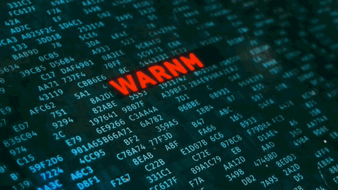

------
------
**
INTEGRANTES GRUPO 5
**

  

------
***

  

***

<table align="center" border="1">
  <tr>
    <th>Liderazgo Organizacional</th>
    <th>INTERCONEXIÓN</th>
    <th>Habilidades de la Organización</th>
  </tr>
  <tr>
    <td align="center">
      
    </td>
    <td align="center">
      
    </td>
    <td align="center">
      
    </td>
  </tr>
</table>

**
 Habilidades de liderazgo (Leadership Skills)
**

Estas habilidades abarcan diversas áreas clave para el liderazgo efectivo en entornos empresariales y estratégicos.

<table border="1" style="width: 100%; border-collapse: collapse;">
    <thead>
        <tr>
            <th style="font-size: 20px; text-align: center;">HABILIDAD</th>
            <th style="font-size: 20px; text-align: center;">DEFINICIÓN</th>
            <th style="font-size: 20px; text-align: center;">IMPORTANCIA PARA UN CISO</th>
        </tr>
    </thead>
    <tbody>
        <tr>
            <td><strong>Estrategia empresarial</strong></td>
            <td style="text-align: justify;">Plan para alcanzar objetivos organizacionales.</td>
            <td style="text-align: justify;">Alinear ciberseguridad con los objetivos de negocio.</td>
        </tr>
        <tr>
            <td><strong>Conocimiento de la industria</strong></td>
            <td style="text-align: justify;">Entender tendencias, regulaciones y riesgos.</td>
            <td style="text-align: justify;">Anticipar amenazas y regulaciones del sector.</td>
        </tr>
        <tr>
            <td><strong>Perspicacia empresarial</strong></td>
            <td style="text-align: justify;">Habilidad para tomar decisiones estratégicas.</td>
            <td style="text-align: justify;">Equilibrar seguridad con rentabilidad y crecimiento.</td>
        </tr>
        <tr>
            <td><strong>Habilidades de comunicación</strong></td>
            <td style="text-align: justify;">Transmitir información de manera efectiva.</td>
            <td style="text-align: justify;">Explicar riesgos técnicos a la alta dirección.</td>
        </tr>
        <tr>
            <td><strong>Habilidades de presentación</strong></td>
            <td style="text-align: justify;">Exponer ideas de forma clara y persuasiva.</td>
            <td style="text-align: justify;">Justificar inversiones en seguridad de manera clara.</td>
        </tr>
        <tr>
            <td><strong>Planificación estratégica</strong></td>
            <td style="text-align: justify;">Diseño de acciones para cumplir objetivos.</td>
            <td style="text-align: justify;">Establecer planes de seguridad a largo plazo.</td>
        </tr>
        <tr>
            <td><strong>Liderazgo técnico</strong></td>
            <td style="text-align: justify;">Capacidad para dirigir equipos especializados.</td>
            <td style="text-align: justify;">Guiar equipos en la implementación de seguridad.</td>
        </tr>
        <tr>
            <td><strong>Consultoría en seguridad</strong></td>
            <td style="text-align: justify;">Asesoría en riesgos y soluciones de seguridad.</td>
            <td style="text-align: justify;">Asesorar sobre riesgos emergentes.</td>
        </tr>
        <tr>
            <td><strong>Gestión de partes interesadas</strong></td>
            <td style="text-align: justify;">Coordinación con actores clave en la empresa.</td>
            <td style="text-align: justify;">Coordinar con directivos y proveedores clave.</td>
        </tr>
        <tr>
            <td><strong>Negociaciones</strong></td>
            <td style="text-align: justify;">Proceso para obtener acuerdos favorables.</td>
            <td style="text-align: justify;">Obtener recursos y acuerdos de seguridad adecuados.</td>
        </tr>
        <tr>
            <td><strong>Misión y visión</strong></td>
            <td style="text-align: justify;">Propósito y proyección a futuro.</td>
            <td style="text-align: justify;">Definir el rol de la seguridad en la organización.</td>
        </tr>
        <tr>
            <td><strong>Valores y cultura</strong></td>
            <td style="text-align: justify;">Principios que rigen el ambiente organizacional.</td>
            <td style="text-align: justify;">Fomentar una cultura organizacional de ciberseguridad.</td>
        </tr>
        <tr>
            <td><strong>Desarrollo de hoja de ruta</strong></td>
            <td style="text-align: justify;">Plan detallado con pasos específicos.</td>
            <td style="text-align: justify;">Establecer pasos concretos para la seguridad.</td>
        </tr>
        <tr>
            <td><strong>Desarrollo de casos de negocio</strong></td>
            <td style="text-align: justify;">Justificación financiera de proyectos.</td>
            <td style="text-align: justify;">Justificar proyectos de seguridad ante la dirección.</td>
        </tr>
        <tr>
            <td><strong>Gestión de proyectos</strong></td>
            <td style="text-align: justify;">Planificación y ejecución de iniciativas.</td>
            <td style="text-align: justify;">Garantizar la ejecución eficiente de estrategias.</td>
        </tr>
        <tr>
            <td><strong>Desarrollo de empleados</strong></td>
            <td style="text-align: justify;">Formación y crecimiento del talento humano.</td>
            <td style="text-align: justify;">Capacitar y retener talento en seguridad.</td>
        </tr>
        <tr>
            <td><strong>Planificación financiera</strong></td>
            <td style="text-align: justify;">Organización de recursos económicos.</td>
            <td style="text-align: justify;">Optimizar la inversión en ciberseguridad.</td>
        </tr>
        <tr>
            <td><strong>Presupuesto</strong></td>
            <td style="text-align: justify;">Asignación de fondos y costos.</td>
            <td style="text-align: justify;">Asignar recursos estratégicamente.</td>
        </tr>
        <tr>
            <td><strong>Innovación</strong></td>
            <td style="text-align: justify;">Aplicación de nuevas ideas y tecnologías.</td>
            <td style="text-align: justify;">Adaptarse a nuevas amenazas y tecnologías.</td>
        </tr>
        <tr>
            <td><strong>Mercadeo</strong></td>
            <td style="text-align: justify;">Promoción de productos y servicios.</td>
            <td style="text-align: justify;">Posicionar la seguridad como ventaja competitiva.</td>
        </tr>
        <tr>
            <td><strong>Liderar el cambio</strong></td>
            <td style="text-align: justify;">Implementación de nuevas estrategias.</td>
            <td style="text-align: justify;">Implementar nuevas políticas sin fricción.</td>
        </tr>
        <tr>
            <td><strong>Relaciones con clientes</strong></td>
            <td style="text-align: justify;">Gestión de la experiencia del cliente.</td>
            <td style="text-align: justify;">Fortalecer la confianza con medidas de seguridad.</td>
        </tr>
        <tr>
            <td><strong>Trabajo en equipo</strong></td>
            <td style="text-align: justify;">Colaboración para alcanzar metas.</td>
            <td style="text-align: justify;">Colaborar con todas las áreas de la empresa.</td>
        </tr>
    </tbody>
</table>

**
**
  **Para un CISO, estas habilidades son clave para proteger la organización y fomentar su crecimiento. 
  La combinación de liderazgo, visión estratégica y conocimiento técnico permite gestionar riesgos, 
  comunicar prioridades y fortalecer una cultura de seguridad.
**

-------

  

***

El Command Center es un componente clave dentro del Security Operations Center (SOC) y tiene un rol esencial en la gestión y coordinación de incidentes de seguridad.

El Command Center actúa como el cerebro operativo durante las operaciones de seguridad y, sobre todo, en la respuesta a incidentes.
Se subdivide o se representa a traves de tres lineas:

Soporte tecnico, aplicacion de la ley y el publico. 

<table align="center" border="1">
  <tr>
    <th>COMMAND CENTER</th>
      </tr>
  <tr>
    <td align="center">
      
    </td>
      </tr>
</table>

## 1. SOPORTE TÉCNICO:
Es el primer nivel de respuesta ante incidentes críticos. Su función principal es gestionar la comunicación con stakeholders clave, como entes regulatorios, clientes, proveedores y autoridades.

<table border="1" style="width:100%; border-collapse: collapse; text-align: left; font-family: Arial, sans-serif;">
  <thead>
    <tr style="background-color: #f2f2f2; text-align: center; font-weight: bold;">
      <th style="padding: 12px; width: 25%;">SECCIÖN</th>
      <th style="padding: 12px; width: 75%;">DESCRIPCIÓN</th>
    </tr>
  </thead>
  <tbody>
      <tr>
      <td style="font-weight: bold; padding: 12px; background-color: #e6f7ff;">Primer Punto de Contacto</td>
      <td style="padding: 12px;">
        <ul>
          <li><strong>Usuarios finales:</strong> Empleados, clientes y proveedores detectan irregularidades.</li>
          <li><strong>Help Desk:</strong> Actúa como primera línea de defensa y registra incidentes.</li>
          <li><strong>Posibles amenazas:</strong>
            <ul>
              <li>Problemas de acceso (posibles ataques a cuentas).</li>
              <li>Correos sospechosos (phishing, malware).</li>
              <li>Rendimiento anómalo de sistemas (posible malware, DDoS).</li>
            </ul>
          </li>
        </ul>
      </td>
    </tr>
    <tr>
      <td style="font-weight: bold; padding: 12px; background-color: #e6f7ff;">Reporte de Incidentes</td>
      <td style="padding: 12px;">
        <ul>
          <li>El <strong>Help Desk</strong> recopila la información inicial del incidente.</li>
          <li>Si se detecta un problema de seguridad, el caso es escalado al <strong>SOC</strong>.</li>
          <li>Este flujo permite una <strong>detección temprana y respuesta rápida</strong>.</li>
        </ul>
      </td>
    </tr>
    <tr>
      <td style="font-weight: bold; padding: 12px; background-color: #e6f7ff;">Integración en la Respuesta a Incidentes</td>
      <td style="padding: 12px;">
        <ul>
          <li>Se informa a los usuarios sobre pasos clave durante un incidente:
            <ul>
              <li>Cambio inmediato de contraseñas.</li>
              <li>Desconexión de dispositivos comprometidos.</li>
            </ul>
          </li>
          <li>Funciona como intermediario entre el <strong>SOC</strong> y los usuarios afectados.</li>
        </ul>
      </td>
    </tr>
    <tr>
      <td style="font-weight: bold; padding: 12px; background-color: #e6f7ff;">Soporte Continuo y Concienciación</td>
      <td style="padding: 12px;">
        <ul>
          <li>El equipo de soporte <strong>educa a los usuarios</strong> sobre buenas prácticas de seguridad.</li>
          <li>Participa en programas de <strong>awareness</strong> para reforzar la cultura de ciberseguridad.</li>
        </ul>
      </td>
    </tr>
  </tbody>
</table>

## 2. APLICACIÓN DE LA LEY:
El término Law Enforcement (Aplicación de la Ley o Autoridades Policiales) aparece como una parte clave dentro de las funciones del Security Operations Center (SOC), específicamente relacionado con la gestión de incidentes y respuesta a eventos de seguridad graves.

<table border="1" style="width:100%; border-collapse: collapse; text-align: left; font-family: Arial, sans-serif;">
  <thead>
    <tr style="background-color: #f2f2f2; text-align: center; font-weight: bold;">
      <th style="padding: 12px; width: 25%;">SECCIÓN</th>
      <th style="padding: 12px; width: 75%;">DESCRIPCIÓN</th>
    </tr>
  </thead>
  <tbody>
    <tr>
      <td style="font-weight: bold; padding: 12px; background-color: #e6f7ff;">Reporte de Actividad Ilegal</td>
      <td style="padding: 12px;">
        <ul>
          <li>Reportar actividades sospechosas o ilegales detectadas en la red o sistemas.</li>
          <li>Coordinar con la policía o agencias gubernamentales para compartir pruebas.</li>
        </ul>
      </td>
    </tr>
    <tr>
      <td style="font-weight: bold; padding: 12px; background-color: #e6f7ff;">Preservación de Evidencia</td>
      <td style="padding: 12px;">
        <ul>
          <li>Preservar la cadena de custodia de los activos afectados.</li>
          <li>Asegurar la integridad de la evidencia digital (forense) para que sea válida ante procesos legales.</li>
        </ul>
      </td>
    </tr>
    <tr>
      <td style="font-weight: bold; padding: 12px; background-color: #e6f7ff;">Comunicación Controlada</td>
      <td style="padding: 12px;">
        <ul>
          <li>La interacción con Law Enforcement debe ser cuidadosamente planificada y aprobada por la dirección y el equipo legal.</li>
          <li>En muchos casos, también involucra la comunicación con clientes o el público, especialmente si el incidente tiene un impacto significativo.</li>
        </ul>
      </td>
    </tr>
    <tr>
      <td style="font-weight: bold; padding: 12px; background-color: #e6f7ff;">Agencias de Law Enforcement</td>
      <td style="padding: 12px;">
        
Dependiendo del país, pueden incluir:

        <ul>
          <li>Policía Nacional o Local (Delitos tecnológicos).</li>
          <li>Agencias especializadas como:
            <ul>
              <li>FBI Cyber Division (EE. UU.).</li>
              <li>Europol EC3 (Europa).</li>
              <li>INTERPOL.</li>
              <li>Organismos regulatorios en casos de incumplimiento (GDPR, PCI DSS, etc.).</li>
            </ul>
          </li>
        </ul>
      </td>
    </tr>
  </tbody>
</table>

## 3. EL PÚBLICO:
Aunque el público general no es parte activa de la operación técnica del SOC, sí es un actor clave en la gestión de comunicación y percepción externa en casos de incidentes importantes (por ejemplo, brechas de datos, ataques mediáticos, interrupciones de servicio, etc.).
Las funciones del SOC relacionadas con el Público son:

<table border="1" style="width:100%; border-collapse: collapse; text-align: left; font-family: Arial, sans-serif;">
  <thead>
    <tr style="background-color: #f2f2f2; text-align: center; font-weight: bold;">
      <th style="padding: 12px; width: 25%;">SECCIÓN</th>
      <th style="padding: 12px; width: 75%;">DESCRIPCIÓN</th>
    </tr>
  </thead>
  <tbody>
    <tr>
      <td style="font-weight: bold; padding: 12px; background-color: #e6f7ff;">Reporte de Actividad Ilegal</td>
      <td style="padding: 12px;">
        <ul>
          <li>Reportar actividades sospechosas o ilegales detectadas en la red o sistemas.</li>
          <li>Coordinar con la policía o agencias gubernamentales para compartir pruebas.</li>
        </ul>
      </td>
    </tr>
    <tr>
      <td style="font-weight: bold; padding: 12px; background-color: #e6f7ff;">Preservación de Evidencia</td>
      <td style="padding: 12px;">
        <ul>
          <li>Preservar la cadena de custodia de los activos afectados.</li>
          <li>Asegurar la integridad de la evidencia digital (forense) para que sea válida ante procesos legales.</li>
        </ul>
      </td>
    </tr>
    <tr>
      <td style="font-weight: bold; padding: 12px; background-color: #e6f7ff;">Comunicación Controlada</td>
      <td style="padding: 12px;">
        <ul>
          <li>La interacción con Law Enforcement debe ser cuidadosamente planificada y aprobada por la dirección y el equipo legal.</li>
          <li>En muchos casos, también involucra la comunicación con clientes o el público, especialmente si el incidente tiene un impacto significativo.</li>
        </ul>
      </td>
    </tr>
    <tr>
      <td style="font-weight: bold; padding: 12px; background-color: #e6f7ff;">¿Qué Agencias de Law Enforcement suelen participar?</td>
      <td style="padding: 12px;">
        <ul>
          <li>Dependiendo del país, pueden incluir:</li>
          <ul>
            <li>Policía Nacional o Local (Delitos tecnológicos).</li>
            <li>Agencias especializadas como: FBI Cyber Division (EE. UU.), Europol EC3 (Europa), INTERPOL.</li>
            <li>Organismos regulatorios en casos de incumplimiento (como GDPR, PCI DSS, etc.).</li>
          </ul>
        </ul>
      </td>
    </tr>
    <tr>
      <td style="font-weight: bold; padding: 12px; background-color: #e6f7ff;">Comunicación y Transparencia</td>
      <td style="padding: 12px;">
        <ul>
          <li>Emisión de comunicados públicos en caso de incidentes que afecten a clientes, usuarios o stakeholders externos.</li>
          <li>Publicación de status reports, avisos de seguridad, y actualizaciones.</li>
          <li>Control de crisis comunicacional para preservar la reputación de la organización.</li>
        </ul>
      </td>
    </tr>
    <tr>
      <td style="font-weight: bold; padding: 12px; background-color: #e6f7ff;">Concienciación y Educación</td>
      <td style="padding: 12px;">
        <ul>
          <li>Programas de concienciación pública sobre ciberseguridad (por ejemplo, alertas de phishing, mejores prácticas para contraseñas, etc.).</li>
          <li>Participación en campañas públicas para aumentar la seguridad general (muy relacionado con el área de Security Awareness).</li>
        </ul>
      </td>
    </tr>
    <tr>
      <td style="font-weight: bold; padding: 12px; background-color: #e6f7ff;">Relación con Clientes y Socios</td>
      <td style="padding: 12px;">
        <ul>
          <li>Brindar atención al público afectado por incidentes:</li>
          <ul>
            <li>Notificación de brechas que involucren datos personales.</li>
            <li>Proporcionar canales de soporte y preguntas frecuentes.</li>
            <li>Informar sobre pasos preventivos o correctivos.</li>
          </ul>
        </ul>
      </td>
    </tr>
  </tbody>
</table>

**
**
  **El Centro de Comando es clave en la gestión de incidentes, integrando soporte técnico, coordinación con autoridades y comunicación efectiva. Su rápida respuesta minimiza riesgos, refuerza la seguridad y protege la reputación organizacional.
**

 ## GRACIAS !!
 ------------

  

