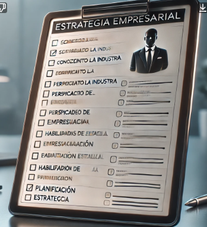
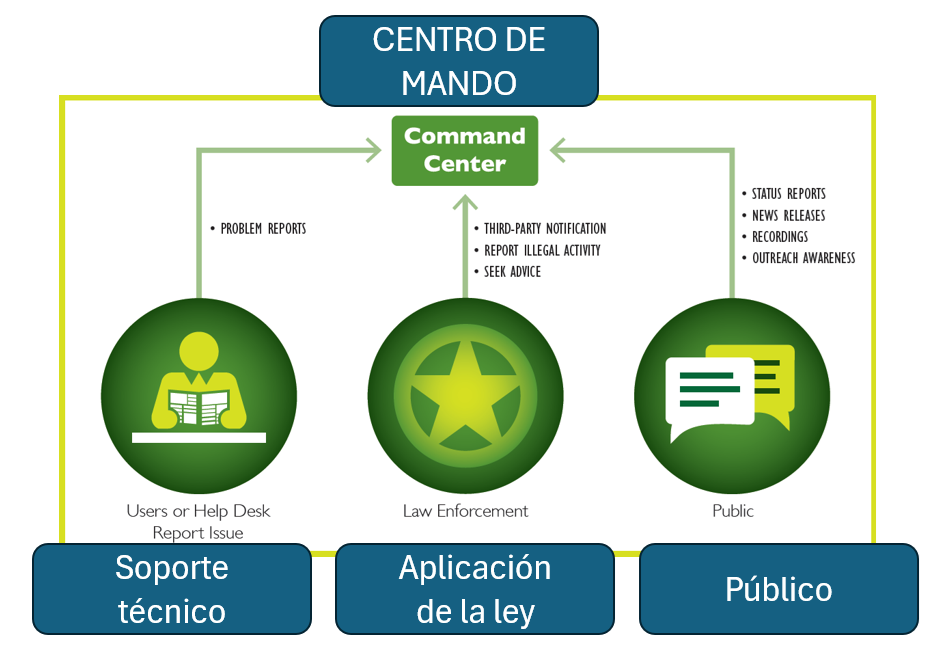

# 
 LEADERSHIP SKILLS 

**
 MY. CARLOS AUGUSTO URIBE VERGARA -- CC. DANNY LEOMAR SÁNCHEZ ROPERO -- CC. JOSÉ JOHAN MARTÍNEZ ROJAS
**

  

**
 Habilidades de liderazgo (Leadership Skills)
**

Estas habilidades abarcan diversas áreas clave para el liderazgo efectivo en entornos empresariales y estratégicos.

<table>
<thead>
<tr>
<th> HABILIDAD</th>
<th>DEFINICIÓN</th>
<th>IMPORTANCIA PARA UN CISO (DoS)</th>
</tr>
</thead>
<tbody>
<th>Estrategia empresarial (MITM)</th>
<th> Plan para alcanzar objetivos organizacionales.</th>
<th> Alinear ciberseguridad con los objetivos de negocio. (XSS)</th>

**1. Estrategia empresarial** – Plan a largo plazo para alcanzar objetivos.

**2. Conocimiento de la industria** – Comprensión del sector y sus dinámicas.

**3. Perspicacia empresarial** – Capacidad para tomar decisiones estratégicas.

**4. Habilidades de comunicación** – Expresar ideas de forma clara y efectiva.

**5. Habilidades de presentación** – Transmitir información de manera impactante.

**6. Planificación estratégica** – Definir metas y acciones clave.

**7. Liderazgo técnico** – Guiar equipos en aspectos tecnológicos.

**8. Consultoría en seguridad** – Asesorar en riesgos y protección.

**9. Gestión de partes interesadas** – Manejo de relaciones clave.

**10. Negociaciones** – Alcanzar acuerdos favorables.

**11. Misión y visión** – Propósito y dirección futura de la empresa.

**12. Valores y cultura** – Principios que guían la organización.

**13.Desarrollo de hoja de ruta** – Plan detallado de acciones.

**14. Desarrollo de casos de negocio** – Justificación para decisiones estratégicas.

**15. Gestión de proyectos** – Organización y ejecución de iniciativas.

**16. Desarrollo de empleados** – Fomentar el crecimiento del talento.

**17. Planificación financiera** – Gestión eficiente de recursos económicos.

**18. Presupuesto** – Asignación y control de gastos.

**19. Innovación** – Introducción de mejoras y nuevas ideas.

**20. Mercadeo** – Estrategias para atraer clientes.

**21. Liderar el cambio** – Gestionar transformaciones organizacionales.

**22. Relaciones con clientes** – Fidelización y satisfacción del consumidor.

**23. Trabajo en equipo** – Colaboración eficaz entre miembros.

Estas habilidades son fundamentales para el éxito en el entorno empresarial moderno. Desde la estrategia y la planificación hasta la comunicación y el liderazgo, cada una aporta al crecimiento organizacional y la toma de decisiones efectivas. Desarrollarlas permite a los profesionales enfrentar desafíos, impulsar la innovación y garantizar la sostenibilidad de sus empresas en un mundo competitivo.

# 
 SOC - COMMAND CENTER 

El Command Center es un componente clave dentro del Security Operations Center (SOC) y tiene un rol esencial en la gestión y coordinación de incidentes de seguridad.

El Command Center actúa como el cerebro operativo durante las operaciones de seguridad y, sobre todo, en la respuesta a incidentes.
Se subdivide o se representa a traves de tres lineas:

Soporte tecnico, aplicacion de la ley, el publico. 

  

**1. Soporte tecnico:** Centraliza la comunicación durante incidentes críticos, incluyendo manejo de crisis y coordinación con stakeholders externos (por ejemplo, entes regulatorios, clientes, proveedores, autoridades).

